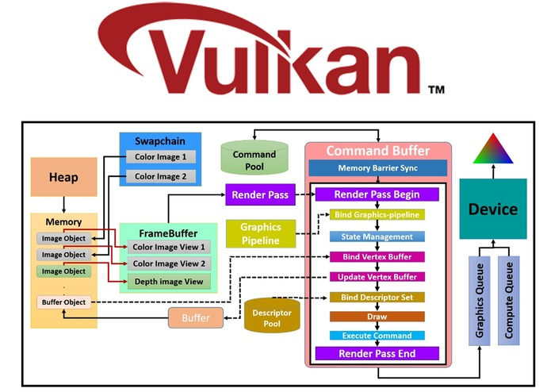

# Vulkan API 설명서
- [VulkanAPI 알아보기](#vulkanapi)
  - [(외부링크)English ver. VulkanAPI 설명서_https://vkguide.dev/](https://vkguide.dev/)
  - [(외부링크)한글 ver. VulkanAPI 설명서_https://vkguide.dev/docs/ko](https://vkguide.dev/docs/ko)

# vulkan-guide

- https://github.com/vblanco20-1/vulkan-guide/ 

# 그림으로 잘 설명
- https://devpost.com/software/vartip
- https://gpuopen.com/news/v-ez-brings-easy-mode-vulkan/

- [(외부 유튜브링크)Intro to Graphics Programming (What it is and where to start) | the lemon](https://youtu.be/Jw-g_Zrz4Ys?si=8XJXJN5yuYM1Z7Qa)

# Instance Call Chain Example
- https://vulkan.lunarg.com/doc/view/1.3.280.0/windows/LoaderInterfaceArchitecture.html#who-should-read-this-document

# Vulkan

# Figure 1 - Vulkan API
- https://gpuopen.com/news/v-ez-brings-easy-mode-vulkan/

# Figure 2- V-EZ middleware layer
- https://gpuopen.com/news/v-ez-brings-easy-mode-vulkan/
  

# Vulkan is a layered architecture, made up of the following elements:
- https://vulkan.lunarg.com/doc/view/1.3.280.0/windows/LoaderInterfaceArchitecture.html
- The Vulkan Application
- The Vulkan Loader
- Vulkan Layers
- Drivers
- VkConfig

 
